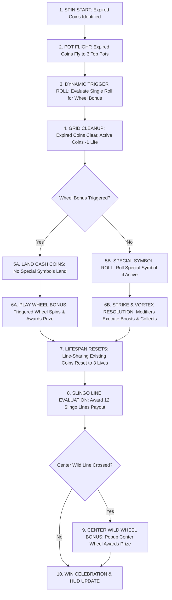

# GAME SPECIFICATION
# CASH VORTEX: TRIPLE POWER™
**Game Specification for Frontend Developers, Game Designers & QA**  
**Version:** 3.0 (3-Pot Expired Coins Engine & Independent X-Wheels)  
**Target Platform:** Mobile, Tablet & Desktop (HTML5 / WebGL)  
**Grid Format:** 5×5 Matrix (25 Reel Positions)  
**Pay Mechanism:** 12 Slingo Lines + Persistent Lock & Win Mechanics + 3-Pot Top Wheels  

---

## 1. Executive Summary & High Concept

**Cash Vortex: Triple Power™** combines the thrill of Slingo line completion with persistent locking cash symbols, explosive modifier mechanics (Strikes and Vortexes), a **3-Pot X-Wheel Bonus System** powered by flying expired coins, an independent center-reel wheel bonus, and a dedicated 5×5 **Lock & Slingo™** respin bonus feature.

Unlike traditional slots where symbols disappear after every spin, symbols in Cash Vortex hold a **3-spin lifespan**, staying locked on the reels to help players complete 5-symbol **Slingo Lines** (horizontal, vertical, and diagonal). When Slingo lines complete, they award the sum of all cash values along that line. If a completed line crosses through the **Central Wild Star**, it triggers the **Center Wild Wheel Bonus**.

At the start of each spin, all expired coins (both un-won coins whose 3-spin lifespan has finished and coins that won on the previous spin) fly up to the **3 X-Wheel Pots** (Mini Wheel Pot, Mega Wheel Pot, Ultra Wheel Pot) above the reels. Each expired coin contributes to a pot, visually growing it and dynamically increasing the chance to trigger that specific wheel bonus!

---

## 2. Screen Layout, UI & Visual Hierarchy

```
+-------------------------------------------------------------+
|              TOP OF REELS: 3 X-WHEEL POTS                   |
|   [ Pot 1: Mini Wheel ]  [ Pot 2: Mega Wheel ]  [ Pot 3: Ultra Wheel ]   |
+-------------------------------------------------------------+
|                                                             |
|   [0,0]       [0,1]       [0,2]       [0,3]       [0,4]     |
|   [1,0]       [1,1]       [1,2]       [1,3]       [1,4]     |
|   [2,0]       [2,1]   ★ CENTER STAR ★ [2,3]       [2,4]     |
|   [3,0]       [3,1]       [3,2]       [3,3]       [3,4]     |
|   [4,0]       [4,1]       [4,2]       [4,3]       [4,4]     |
|                                                             |
+-------------------------------------------------------------+
| HUD: [ Bet Selector ]   [ Total Win Display ]   [ Spin Button ] |
+-------------------------------------------------------------+
```

### Visual Components:
1. **The 5×5 Main Grid:** 25 cell positions indexed from `(0,0)` to `(4,4)`.
   * The center cell `(2,2)` is permanently occupied in the base game by the **Central Wild Star**.
2. **Top-of-Reels 3-Pot X-Wheels HUD:** 3 interactive wheel pots displayed above the reels:
   * **Pot 1 (Mini Wheel):** Frequent base tier prize wheel.
   * **Pot 2 (Mega Wheel):** Mid tier prize wheel with enhanced rewards and direct Lock & Slingo access.
   * **Pot 3 (Ultra Wheel):** Premium top tier prize wheel with Ultra Jackpot (500x) and massive multipliers.
3. **Symbol Life Indicators:** Every active coin on the grid features an animated visual life meter (`3` $\rightarrow$ `2` $\rightarrow$ `1` $\rightarrow$ expired/flying to pots).
4. **Slingo Paylines Overlay:** 12 predefined winning lines across the grid (5 Horizontal, 5 Vertical, 2 Diagonal).

---

## 3. Symbol Catalog & Feature Definitions

| Symbol | Visual Identifier | Base Cash Value | Special Function & Behavior |
| :--- | :--- | :--- | :--- |
| **Central Wild Star** | Gold Glowing Star at `(2,2)` | `0.0x` (No cash) | Permanent Wild. Completes any row, column, or diagonal passing through the center. Never expires and is never removed from the grid. |
| **Blank** | Transparent / Dark Cell | `0.0x` | Empty position where new symbols can land. |
| **Cash Coin** | Bronze/Silver/Gold Coin | `0.2x` – `5.0x` Bet | Holds a cash value. Starts with **3 Lives**. When expired or won, flies to one of the 3 top wheel pots. |
| **Jackpot Coin** | Ruby / Sapphire / Diamond Coin | `Mini` (5x), `Mega` (50x), `Ultra` (500x) | Fixed Jackpot coin. Starts with **3 Lives**. **Strictly isolated from modifiers.** |
| **Mini Strike** | Blue Lightning Coin | Variable (`0.2x`–`5.0x`) | On landing, adds its cash value to all **4 orthogonal neighbors** (Up, Down, Left, Right). |
| **Mega Strike** | Purple Lightning Coin | Variable (`0.2x`–`5.0x`) | On landing, adds its cash value to **all symbols sharing any Slingo line** with this cell. |
| **Ultra Strike** | Gold Lightning Coin | Variable (`0.2x`–`5.0x`) | On landing, adds its cash value to **all valuable symbols across the entire 5×5 grid**. |
| **Mini Vortex** | Blue Swirling Portal | Starts at `1.0x` | On landing, **gathers and sums** cash values of all **4 orthogonal neighbors** into itself. |
| **Mega Vortex** | Purple Swirling Portal | Starts at `2.0x` | On landing, **gathers and sums** cash values of **all symbols sharing any Slingo line** into itself. |
| **Ultra Vortex** | Gold Swirling Portal | Starts at `5.0x` | On landing, **gathers and sums** cash values of **all valuable symbols across the entire grid** into itself. |

*(Note: There is no X symbol in this game. All wheel triggering is driven by the 3-pot expired coins system).*

---

## 4. Base Game Mechanics & Execution Sequence

When the player presses **SPIN**, the game resolves in the following exact chronological sequence:



### Detailed Sequence Breakdown:

### Step 1: Expired Coins Pot Flight & Dynamic Trigger Phase
Before new symbols land on the reels:
1. **Identify Expired Coins:** All coins that won on the previous spin (`WonThisSpin = true`) or reached the end of their 3-spin lifespan (`LifeRemaining <= 1`) are identified as expiring coins.
2. **Pot Destination Sampling:** Each expired coin independently samples which pot it flies to based on the Pot Chance weight table:
   * **Wheel 1 Pot (Mini):** Weight = 230
   * **Wheel 2 Pot (Mega):** Weight = 150
   * **Wheel 3 Pot (Ultra):** Weight = 20
   This produces counts $N_1$, $N_2$, and $N_3$ of coins flying to each pot.
3. **Dynamic Single-Roll Trigger Weight Calculation:**
   $$\text{Weight Pot 1} = N_1 \times 1000$$
   $$\text{Weight Pot 2} = N_2 \times 100$$
   $$\text{Weight Pot 3} = N_3 \times 20$$
   $$\text{Weight No-Trigger} = 100000$$
   $$\text{Total Weight} = W_1 + W_2 + W_3 + W_{\text{No-Trigger}}$$
4. **Single Random Roll:** A single roll determines if Pot 1 (Mini Wheel), Pot 2 (Mega Wheel), Pot 3 (Ultra Wheel), or No Wheel triggers. At most one wheel bonus triggers per spin.
5. **Grid Cleanup:** Expired coins disappear from the grid, and surviving coins have their life counter decremented by 1 (`3` $\rightarrow$ `2`, or `2` $\rightarrow$ `1`).

### Step 2: Symbol Landing & Wheel Execution Phase
* **Case A: Wheel Bonus Triggered:**
  1. Special symbol selection is **bypassed** (no special symbols land on this spin).
  2. Empty grid positions are filled with Cash Coins / Blanks according to the active table.
  3. The triggered wheel (Mini, Mega, or Ultra) immediately spins and awards its prize:
     * **Multiplier (`x2`, `x3`, `x4`, `x5`, `x10`):** Multiplies all non-blank cash coins currently on the board.
     * **Ultra Strike (`1`, `2`, `3`, `4`, `5`):** Adds fixed cash boost to all non-blank cash coins across the entire board.
     * **Direct Jackpot (`Mini`, `Mega`, `Ultra`):** Directly pays out the jackpot to the player.
     * **Lock & Slingo:** Triggers the Lock & Slingo™ Bonus Game!
* **Case B: No Wheel Bonus Triggered:**
  1. The game evaluates special symbol selection normally (pool includes Jackpot Coins, Mini/Mega/Ultra Strikes, and Mini/Mega/Ultra Vortexes; no X symbol).
  2. Empty positions are filled with Cash Coins / Blanks.
  3. Modifiers execute in order (Strikes boost first, Vortexes collect second).

### Step 3: Symbol Life Cycle Reset Phase
* Any existing symbol on the reels that shares **any of the 12 Slingo lines** with a **newly landed symbol** has its lifespan **reset back to 3 Lives**!

### Step 4: 12 Slingo Lines Evaluation Phase
* Completed lines pay the sum of all cash values along the line.
* If multiple lines complete, all line payouts are aggregated.

### Step 5: Center Wild Wheel Bonus Trigger Phase
* If any completed Slingo line crosses through the **Central Wild Star** at `(2,2)`, the **Center Wild Wheel Bonus** is triggered!

---

## 5. Center Wild Wheel Bonus

When activated by a center-crossing Slingo line:
1. An ornate Bonus Wheel appears as an overlay in the center of the reels.
2. The wheel spins and awards one of the following slices:
   * **Instant Cash Multipliers (`1`, `2`, `3`, `4`, `5`):** Instantly pays $1\text{x}$ to $5\text{x}$ the total bet.
   * **Mini Jackpot:** Awards fixed **5x Bet**.
   * **Mega Jackpot:** Awards fixed **50x Bet**.
   * **Ultra Jackpot:** Awards fixed **500x Bet**.
   * **Lock & Slingo:** Immediately launches the **Lock & Slingo™ Bonus Game**!

---

## 6. Lock & Slingo™ Bonus Game

The **Lock & Slingo™ Bonus Game** is a pure Hold-and-Spin feature with cascading 3-respin mechanics:
1. **Empty Starting Board:** Starts on an empty 5×5 grid without the central star.
2. **Permanent Locking:** All symbols that land in the bonus lock permanently (no 3-spin expiration, no coins fly to pots).
3. **3 Respins (Lives):** Landing $\ge 1$ symbol resets lives to 3; 3 consecutive blanks end the bonus.
4. **No Wheels / No X Symbols:** All wheels and X symbols are removed from the bonus.
5. **Slingo Ladder Award:** When the bonus concludes, the highest achieved Slingo Ladder prize is awarded on top of all locked coin cash values!

| Completed Slingos | Awarded Ladder Prize |
| :---: | :--- |
| **0 – 3 Lines** | No ladder prize |
| **4 Lines** | **Mini Jackpot (5x Bet)** |
| **5 Lines** | **Ultra Strike +1x Boost** (Adds +1x to all non-jackpot coins) |
| **6 Lines** | **Ultra Strike +2x Boost** (Adds +2x to all non-jackpot coins) |
| **7 Lines** | **Ultra Strike +3x Boost** (Adds +3x to all non-jackpot coins) |
| **8 Lines** | **Mega Jackpot (50x Bet)** |
| **9 Lines** | **Ultra Strike +5x Boost** (Adds +5x to all non-jackpot coins) |
| **10 Lines** | **Multiplier x2 Boost** (Doubles all non-jackpot coins) |
| **11 Lines** | *Skipped (Geometry rule - impossible on 5x5 grid)* |
| **12 Lines (Full House)** | **Ultra Jackpot (500x Bet)** |

---

## 7. Critical Isolation Rules & Edge Cases

### A. The Jackpot Isolation Rule (CRITICAL)
Jackpot Coins (`Mini`, `Mega`, `Ultra`) are **completely immune** to all game modifiers:
* **Cash Strikes:** Lightning strikes will **NOT** add cash value to any Jackpot Coin.
* **Cash Vortexes:** Vortex suction will **NOT** collect or copy the value of any Jackpot Coin.
* **X-Wheel Multipliers:** Multipliers (e.g. `x2`, `x5`, `x10`) will **NOT** multiply any Jackpot Coin.
* *Visual/Audio Cue:* If lightning or vortex passes near a Jackpot Coin, display an energetic shield/deflection VFX.

### B. The Central Wild Star Rules
* Has **0.0 cash value** (does not add numerical value to a Slingo line payout).
* Acts as a universal substitute completing any line passing through `(2,2)`.
* Cannot be destroyed, modified, multiplied, or collected by Vortexes.
* Always remains on the board in the base game.

### C. The 11-Slingo Geometric Skip Rule
* On a 5×5 grid, when 24 out of 25 spaces are filled, exactly 10 lines are complete.
* Filling the final 25th space simultaneously completes both its row and its column (and potentially diagonals), jumping the count immediately from **10 to 12 Slingos**.
* Therefore, **11 Slingos cannot exist**; the ladder correctly advances directly from 10 to 12.

### D. Multiple Simultaneous Line Completions
* When multiple Slingo lines complete in the same spin, the player wins the sum of **all** completed lines.
* If a single coin is part of 2 intersecting winning lines (e.g. Row 2 and Column 2), its value is counted and paid **twice**!
* All non-central symbols in those lines are flagged and will be removed together at the start of the next spin.

### E. Multiple Center Line Completions
* If a spin completes both diagonals and both center lines at once, the **Center Wild Wheel Bonus is triggered exactly once**.

### F. Full House in Bonus Game
* If all 25 spaces are filled in Lock & Slingo, the round concludes immediately with a **Full House Celebration**, awarding the **Ultra Jackpot (500x)** ladder prize plus the sum of all 25 locked coins.

---

## 8. Frontend Animation & Audio Choreography

| Game Event | Visual VFX / Animation | Sound Effect (SFX) |
| :--- | :--- | :--- |
| **Coin Landing** | Impact slam with gold dust particle burst; numeric life badge appears (`3`). | Metallic coin drop / heavy clink. |
| **Strike Trigger** | Electric arcs shoot from Strike symbol across target cells with glowing impact rings. | Crackling thunder / electric zap. |
| **Vortex Trigger** | Swirling gravity well vortex with particle streams flowing into the portal center. | Deep whoosh / resonant vacuum pulse. |
| **Expired Coin Pot Flight** | Expired coins lift from grid and fly in glowing arcs into top Mini, Mega, or Ultra pots. | Whooshing sparkle arc / pot coin clink. |
| **Pot Growth / Expansion** | Targeted top wheel pot pulses, shakes, and visibly grows larger with aura. | Rising shimmer tone / resonant hum. |
| **X-Wheel Pot Trigger** | Triggered top wheel pot bursts with golden fireworks and expands to spin. | Grand triumphal fanfare / brass swell. |
| **Life Reset** | Glowing pulse travels along connected Slingo line; coin life counters flash back to `3`. | Magical sparkle chime. |
| **Slingo Line Win** | Gold line tracing with glowing border; coin numbers fly into win meter. | Cash register bell / crescendo chords. |
| **Center Wheel Trigger** | Center Wild Star explodes in golden rays; Center Wheel expands onto screen. | Dramatic brass fanfare. |
| **Lock & Slingo Intro** | Base grid flips away into dark galaxy vortex; 3 heart life meters ignite. | Eerie thunder transition / orchestral swell. |
| **Full House Win** | Full screen fireworks, gold coin shower, flashing jackpot banner. | Epic grand jackpot celebratory theme. |

---

*Document generated for BoGamingRealms - Cash Vortex: Triple Power™ Simulator & Game Client Development.*

