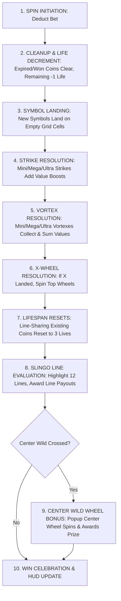

# GAME SPECIFICATION
# CASH VORTEX: TRIPLE POWER™
**Game Specification for Frontend Developers, Game Designers & QA**  
**Version:** 2.0 (Consolidated Triple Power Engine)  
**Target Platform:** Mobile, Tablet & Desktop (HTML5 / WebGL)  
**Grid Format:** 5×5 Matrix (25 Reel Positions)  
**Pay Mechanism:** 12 Slingo Lines + Persistent Lock & Win Mechanics  

---

## 1. Executive Summary & High Concept

**Cash Vortex: Triple Power™** combines the thrill of Slingo line completion with persistent locking cash symbols, explosive modifier mechanics (Strikes and Vortexes), a 3-tier top wheel progression system (X-Wheels), an independent center-reel wheel bonus, and a dedicated 5×5 **Lock & Slingo™** respin bonus feature.

Unlike traditional slots where symbols disappear after every spin, symbols in Cash Vortex hold a **3-spin lifespan**, staying locked on the reels to help players complete 5-symbol **Slingo Lines** (horizontal, vertical, and diagonal). When Slingo lines complete, they award the sum of all cash values along that line. If a completed line crosses through the **Central Wild Star**, it triggers the **Center Wild Wheel Bonus**.

---

## 2. Screen Layout, UI & Visual Hierarchy

```
+-------------------------------------------------------------+
|                     TOP OF REELS: X-WHEELS                  |
|   [ Wheel 1: Mini ]   -->   [ Wheel 2: Mega ]   -->   [ Wheel 3: Ultra ]   |
+-------------------------------------------------------------+
|                                                             |
|   [0,0]       [0,1]       [0,2]       [0,3]       [0,4]     |
|   [1,0]       [1,1]       [1,2]       [1,3]       [1,4]     |
|   [2,0]       [2,1]   ★ CENTER STAR ★ [2,3]       [2,4]     |
|   [3,0]       [3,1]       [3,2]       [3,3]       [3,4]     |
|   [4,0]       [4,1]       [4,2]       [4,3]       [4,4]     |
|                                                             |
+-------------------------------------------------------------+
| HUD: [ Bet Selector ]   [ Total Win Display ]   [ Spin Button ] |
+-------------------------------------------------------------+
```

### Visual Components:
1. **The 5×5 Main Grid:** 25 cell positions indexed from `(0,0)` to `(4,4)`.
   * The center cell `(2,2)` is permanently occupied in the base game by the **Central Wild Star**.
2. **Top-of-Reels X-Wheels HUD:** A 3-wheel visual apparatus displayed above the reels:
   * **Wheel 1 (Mini):** Base level wheel.
   * **Wheel 2 (Mega):** Mid tier wheel with enhanced rewards.
   * **Wheel 3 (Ultra):** Top tier wheel with maximum jackpots and multipliers.
3. **Symbol Life Indicators:** Every active coin on the grid features an animated visual life meter (e.g. 3 glowing gems or a circular countdown gauge: `3` $\rightarrow$ `2` $\rightarrow$ `1` $\rightarrow$ expired/popped).
4. **Slingo Paylines Overlay:** 12 predefined winning lines across the grid (5 Horizontal, 5 Vertical, 2 Diagonal).

---

## 3. Symbol Catalog & Feature Definitions

| Symbol | Visual Identifier | Base Cash Value | Special Function & Behavior |
| :--- | :--- | :--- | :--- |
| **Central Wild Star** | Gold Glowing Star at `(2,2)` | `0.0x` (No cash) | Permanent Wild. Completes any row, column, or diagonal passing through the center. Never expires and is never removed from the grid. |
| **Blank** | Transparent / Dark Cell | `0.0x` | Empty position where new symbols can land. |
| **Cash Coin** | Bronze/Silver/Gold Coin | `0.2x` – `5.0x` Bet | Holds a cash value. Starts with **3 Lives**. |
| **Jackpot Coin** | Ruby / Sapphire / Diamond Coin | `Mini` (5x), `Mega` (50x), `Ultra` (500x) | Fixed Jackpot coin. Starts with **3 Lives**. **Strictly isolated from modifiers.** |
| **Mini Strike** | Blue Lightning Coin | Variable (`0.2x`–`5.0x`) | On landing, adds its cash value to all **4 orthogonal neighbors** (Up, Down, Left, Right). |
| **Mega Strike** | Purple Lightning Coin | Variable (`0.2x`–`5.0x`) | On landing, adds its cash value to **all symbols sharing any Slingo line** with this cell. |
| **Ultra Strike** | Gold Lightning Coin | Variable (`0.2x`–`5.0x`) | On landing, adds its cash value to **all valuable symbols across the entire 5×5 grid**. |
| **Mini Vortex** | Blue Swirling Portal | Starts at `0.0x` | On landing, **gathers and sums** cash values of all **4 orthogonal neighbors** into itself. |
| **Mega Vortex** | Purple Swirling Portal | Starts at `0.0x` | On landing, **gathers and sums** cash values of **all symbols sharing any Slingo line** into itself. |
| **Ultra Vortex** | Gold Swirling Portal | Starts at `0.0x` | On landing, **gathers and sums** cash values of **all valuable symbols across the entire grid** into itself. |
| **X Symbol** | Neon Multiplier 'X' Coin | `1.0x` Bet | Starts with 3 Lives. On landing, immediately triggers the **Top X-Wheels Feature**. |

---

## 4. Base Game Mechanics & Execution Sequence

When the player presses **SPIN**, the frontend animation and visual state transitions **MUST** execute in the following exact chronological sequence:



### Detailed Sequence Breakdown:

### Step 1: Cleanup & Lifespan Decrement Phase
Before new symbols land on the grid:
1. **Remove Won Symbols:** Any symbol that was part of a winning Slingo line on the previous spin is removed (fades/pops), freeing up its cell into a `Blank`.
2. **Remove Expired Symbols:** Any existing symbol that had only `1 Life` remaining (and was not part of a winning line) expires and disappears.
3. **Decrement Lifespans:** All surviving symbols on the board have their life counter reduced by 1 (`3` $\rightarrow$ `2`, or `2` $\rightarrow$ `1`).
4. *Exception:* The **Central Wild Star** at `(2,2)` is permanent and is never decremented or cleared.

### Step 2: Symbol Landing Phase
1. New symbols land only on available `Blank` grid positions.
2. Every newly landed symbol initializes with **3 Lives** (`LifeRemaining = 3`).
3. **Guaranteed Symbol Rule:** A spin is never completely blank; at least 1 symbol is guaranteed to land on every spin as long as an empty space exists.

### Step 3: Special Symbol Execution Phase (Strikes then Vortexes)
If modifier symbols land on the grid, they animate in strict order:
1. **Strikes Animate First:**
   * **Mini Strike:** Lightning strikes the 4 orthogonal neighboring cells (Up, Down, Left, Right), adding the Strike’s value to each valid coin.
   * **Mega Strike:** Lightning shoots along all horizontal, vertical, and diagonal lines passing through the cell, adding its value to all line-sharing coins.
   * **Ultra Strike:** A shockwave covers the entire board, boosting all valid coins on the reels.
2. **Vortexes Animate Second:**
   * **Mini Vortex:** Whirlpool suction pulls values from 4 orthogonal neighbors, summing them into the Vortex’s own value.
   * **Mega Vortex:** Pulls values from all line-sharing coins, summing them into itself.
   * **Ultra Vortex:** Pulls values from all coins on the entire grid, summing them into itself.
   * *Note on Targets:* Original target coins **retain** their values on the board (they are copied/summed, not destroyed).

### Step 4: X-Wheel Feature Phase
If an **X Symbol** lands on the reels:
1. The camera focuses on the **Top X-Wheels HUD**.
2. **Wheel 1 (Mini)** spins:
   * If it lands on `Upgrade`, an ascending beam of light activates **Wheel 2 (Mega)**, which immediately spins.
   * If Wheel 2 lands on `Upgrade`, **Wheel 3 (Ultra)** activates and spins.
3. Wheel awards:
   * **Multiplier (`x2`, `x3`, `x4`, `x5`, `x10`):** An animated multiplier flashes and multiplies the cash value of all valid coins on the board.
   * **Ultra Strike (`1`, `2`, `3`, `4`, `5`):** Distributes an instant cash boost to all valid coins across the board.
   * **Direct Jackpot (`Mini`, `Mega`, `Ultra`):** Directly pays out the jackpot to the player's win meter.
   * **Lock & Slingo:** Triggers the Lock & Slingo™ Bonus Game!

### Step 5: Symbol Life Cycle Reset Phase
* Any existing symbol on the reels that shares **any of the 12 Slingo lines** with a **newly landed symbol** has its lifespan **reset back to 3 Lives**!
* *Player Experience:* Landing new coins keeps existing near-complete lines alive!

### Step 6: 12 Slingo Lines Evaluation Phase
The engine checks all 12 Slingo lines (5 Horizontal, 5 Vertical, 2 Diagonal):
1. A line is **complete** when all 5 positions contain non-blank symbols.
2. **Line Payout:** The player is awarded the **exact sum of all cash values** along that line ($1\text{x bet} = 100\text{ cents}$).
3. If a symbol belongs to multiple completed lines on the same spin (e.g. crossing of a horizontal row and vertical column), its cash value is paid out for **each** completed line!
4. Completed symbols are marked with a winning glow and will pop/clear at the start of the next spin.

### Step 7: Center Wild Wheel Bonus Trigger Phase
* If **any** completed Slingo line crosses through the **Central Wild Star** at position `(2,2)` (Line 3: Center Row, Line 8: Center Column, Line 11: Main Diagonal, or Line 12: Anti-Diagonal), the **Center Wild Wheel Bonus** is triggered!
* **Single Spin Rule:** Even if 2, 3, or 4 center-crossing lines complete simultaneously in one spin, the Center Wild Wheel Bonus is triggered **exactly once**.

---

## 5. Center Wild Wheel Bonus

When activated by a center-crossing Slingo line:
1. An ornate Bonus Wheel appears as a modal/overlay in the center of the reels.
2. The wheel spins and awards one of the following slices:
   * **Instant Cash Multipliers (`1`, `2`, `3`, `4`, `5`):** Instantly pays $1\text{x}$ to $5\text{x}$ the total bet.
   * **Mini Jackpot:** Awards fixed **5x Bet**.
   * **Mega Jackpot:** Awards fixed **50x Bet**.
   * **Ultra Jackpot:** Awards fixed **500x Bet**.
   * **Lock & Slingo:** Immediately launches the **Lock & Slingo™ Bonus Game**!

---

## 6. Lock & Slingo™ Bonus Game

The **Lock & Slingo™ Bonus Game** is a 5×5 persistent Lock & Win feature with cascading respin mechanics.

```
+-------------------------------------------------------------+
|                 LOCK & SLINGO™ BONUS ROUND                  |
|          LIVES REMAINING: [ ♥ ] [ ♥ ] [ ♥ ] (3/3)           |
+-------------------------------------------------------------+
| SLINGO LADDER PRIZES               BONUS 5x5 BOARD          |
| 12 Slingos: ULTRA JACKPOT (500x)   [ ] [ ] [ ] [ ] [ ]      |
| 10 Slingos: Multiplier x2          [ ] [ ] [ ] [ ] [ ]      |
|  9 Slingos: Ultra Strike 5x        [ ] [ ] [ ] [ ] [ ]      |
|  8 Slingos: MEGA JACKPOT (50x)     [ ] [ ] [ ] [ ] [ ]      |
|  7 Slingos: Ultra Strike 3x        [ ] [ ] [ ] [ ] [ ]      |
|  6 Slingos: Ultra Strike 2x                                 |
|  5 Slingos: Ultra Strike 1x        TOTAL BONUS WIN:         |
|  4 Slingos: MINI JACKPOT (5x)      $0.00                    |
+-------------------------------------------------------------+
```

### Core Rules of the Bonus:
1. **Empty Starting Board:** The bonus begins with an empty 5×5 grid (25 empty positions).
   * *Critical Distinction:* The **Central Wild Star does not exist** in the bonus round. Position `(2,2)` is an empty space that can be landed on.
2. **Player Lives (3 Respins):**
   * The player starts with **3 Lives**.
   * **Landing Spin:** If $\ge 1$ symbol lands on the board, **lives immediately reset to 3**.
   * **Blank Spin:** If 0 symbols land, lives decrease by 1 (`3` $\rightarrow$ `2` $\rightarrow$ `1` $\rightarrow$ `0`).
3. **Permanent Symbol Locking (No Expiration):**
   * Symbols in the bonus **never expire**. Once a symbol lands, it remains permanently locked on the board until the entire bonus round concludes.
4. **Active Modifiers in Bonus:**
   * Newly landed Strikes fire lightning and boost locked coins.
   * Newly landed Vortexes gather locked coin values.
   * Newly landed X Symbols spin the Bonus X-Wheels.
5. **Bonus End Conditions:**
   * **Out of Lives:** Player suffers 3 consecutive blank spins (Lives = 0).
   * **Full House:** All 25 positions on the board are filled with locked symbols!

### Slingo Pay Ladder & Final Payout Calculation:
When the bonus round ends:
1. The engine counts how many complete 5-symbol Slingo lines (0 to 12) have been formed by locked symbols.
2. The player is awarded their **highest achieved Slingo Ladder prize**:

| Completed Slingos | Awarded Ladder Prize |
| :---: | :--- |
| **0 – 3 Lines** | No ladder prize |
| **4 Lines** | **Mini Jackpot (5x Bet)** |
| **5 Lines** | **Ultra Strike +1x Boost** (Adds +1x to all non-jackpot coins) |
| **6 Lines** | **Ultra Strike +2x Boost** (Adds +2x to all non-jackpot coins) |
| **7 Lines** | **Ultra Strike +3x Boost** (Adds +3x to all non-jackpot coins) |
| **8 Lines** | **Mega Jackpot (50x Bet)** |
| **9 Lines** | **Ultra Strike +5x Boost** (Adds +5x to all non-jackpot coins) |
| **10 Lines** | **Multiplier x2 Boost** (Doubles all non-jackpot coins) |
| **11 Lines** | *Skipped (Geometry rule - impossible on 5x5 grid)* |
| **12 Lines (Full House)** | **Ultra Jackpot (500x Bet)** |

3. **Total Bonus Win Awarded to Player:**
   $$\text{Total Win} = \sum (\text{All Locked Symbol Cash Values on Grid}) + \text{Highest Slingo Ladder Prize} + \text{Direct Wheel Jackpots}$$

---

## 7. Critical Isolation Rules & Edge Cases

### A. The Jackpot Isolation Rule (CRITICAL)
Jackpot Coins (`Mini`, `Mega`, `Ultra`) are **completely immune** to all game modifiers:
* **Cash Strikes:** Lightning strikes will **NOT** add cash value to any Jackpot Coin.
* **Cash Vortexes:** Vortex suction will **NOT** collect or copy the value of any Jackpot Coin.
* **X-Wheel Multipliers:** Multipliers (e.g. `x2`, `x5`, `x10`) will **NOT** multiply any Jackpot Coin.
* *Visual/Audio Cue:* If lightning or vortex passes near a Jackpot Coin, display an energetic shield/deflection VFX.

### B. The Central Wild Star Rules
* Has **0.0 cash value** (does not add numerical value to a Slingo line payout).
* Acts as a universal substitute completing any line passing through `(2,2)`.
* Cannot be destroyed, modified, multiplied, or collected by Vortexes.
* Always remains on the board in the base game.

### C. The 11-Slingo Geometric Skip Rule
* On a 5×5 grid, when 24 out of 25 spaces are filled, exactly 10 lines are complete.
* Filling the final 25th space simultaneously completes both its row and its column (and potentially diagonals), jumping the count immediately from **10 to 12 Slingos**.
* Therefore, **11 Slingos cannot exist**; the ladder correctly advances directly from 10 to 12.

### D. Multiple Simultaneous Line Completions
* When multiple Slingo lines complete in the same spin, the player wins the sum of **all** completed lines.
* If a single coin is part of 2 intersecting winning lines (e.g. Row 2 and Column 2), its value is counted and paid **twice**!
* All non-central symbols in those lines are flagged and will be removed together at the start of the next spin.

### E. Multiple Center Line Completions
* If a spin completes both diagonals and both center lines at once, the **Center Wild Wheel Bonus is triggered exactly once**.

### F. Full House in Bonus Game
* If all 25 spaces are filled in Lock & Slingo, the round concludes immediately with a **Full House Celebration**, awarding the **Ultra Jackpot (500x)** ladder prize plus the sum of all 25 locked coins.

---

## 8. Frontend Animation & Audio Choreography

| Game Event | Visual VFX / Animation | Sound Effect (SFX) |
| :--- | :--- | :--- |
| **Coin Landing** | Impact slam with gold dust particle burst; numeric life badge appears (`3`). | Metallic coin drop / heavy clink. |
| **Strike Trigger** | Electric arcs shoot from Strike symbol across target cells with glowing impact rings. | Crackling thunder / electric zap. |
| **Vortex Trigger** | Swirling gravity well vortex with particle streams flowing into the portal center. | Deep whoosh / resonant vacuum pulse. |
| **X-Wheel Upgrade** | Energy beam erupts upward from lower wheel, illuminating next wheel tier. | Ascending synthesizer chime / fanfare. |
| **Life Reset** | Glowing pulse travels along connected Slingo line; coin life counters flash back to `3`. | Magical sparkle chime. |
| **Slingo Line Win** | Gold line tracing with glowing border; coin numbers fly into win meter. | Cash register bell / crescendo chords. |
| **Center Wheel Trigger** | Center Wild Star explodes in golden rays; Center Wheel expands onto screen. | Dramatic brass fanfare. |
| **Lock & Slingo Intro** | Base grid flips away into dark galaxy vortex; 3 heart life meters ignite. | Eerie thunder transition / orchestral swell. |
| **Full House Win** | Full screen fireworks, gold coin shower, flashing jackpot banner. | Epic grand jackpot celebratory theme. |

---

*Document generated for BoGamingRealms - Cash Vortex: Triple Power™ Simulator & Game Client Development.*
