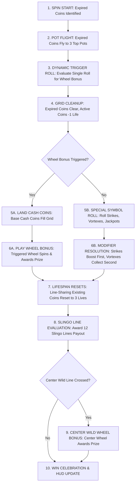

# GAME SPECIFICATION
# CASH VORTEX: TRIPLE POWER™
**Game Specification for Frontend Developers, Game Designers & QA**  
**Version:** 3.0 (3-Pot Expired Coins Engine & Independent Top Wheels)  
**Target Platform:** Mobile, Tablet & Desktop (HTML5 / WebGL)  
**Grid Format:** 5×5 Matrix (25 Reel Positions)  
**Pay Mechanism:** 12 Slingo Lines + Persistent Lock & Win Mechanics + 3-Pot Top Wheels  

---

## Document Revision History

| Version | Date | Summary of Changes | Author / Team |
| :---: | :---: | :--- | :--- |
| **v3.0** | Sep 2026 | Added 3-Pot Top Wheel trigger system powered by flying expired coins, redesigned top wheels as independent prize wheels, streamlined Lock & Slingo™ bonus, and recalibrated math to 95.50% RTP. | Math & Game Design |
| **v2.0** | Aug 2026 | Added full 12-rank Slingo Ladder prize achievements to Lock & Slingo™, added Center Wild Wheel Bonus, and formalized Jackpot isolation rules. | Math & Engineering |
| **v1.0** | Jun 2026 | Initial game specification featuring 5×5 matrix, 12 Slingo paylines, 3-spin persistent coin lifespans, Cash Strikes, and Cash Vortexes. | Game Design |

---

## 1. Executive Summary & High Concept

**Cash Vortex: Triple Power™** combines the thrill of Slingo line completion with persistent locking cash symbols, explosive modifier mechanics (Strikes and Vortexes), a **3-Pot Top Wheel Bonus System** powered by flying expired coins, an independent center-reel wheel bonus, and a dedicated 5×5 **Lock & Slingo™** respin bonus feature.

Unlike traditional slots where symbols disappear after every spin, symbols in Cash Vortex hold a **3-spin lifespan**, staying locked on the reels to help players complete 5-symbol **Slingo Lines** (horizontal, vertical, and diagonal). When Slingo lines complete, they award the sum of all cash values along that line. If a completed line crosses through the **Central Wild Star**, it triggers the **Center Wild Wheel Bonus**.

At the start of each spin, all expired coins (both un-won coins whose 3-spin lifespan has finished and coins that won on the previous spin) fly up to the **3 Top Wheel Pots** (Mini Wheel Pot, Mega Wheel Pot, Ultra Wheel Pot) above the reels. Each expired coin contributes to a pot, visually growing it and dynamically increasing the chance to trigger that specific wheel bonus.

---

## 2. Screen Layout & Visual Hierarchy

```
+-------------------------------------------------------------+
|                TOP OF REELS: 3 WHEEL POTS                   |
|   [ Pot 1: Mini Wheel ]  [ Pot 2: Mega Wheel ]  [ Pot 3: Ultra Wheel ]   |
+-------------------------------------------------------------+
|                                                             |
|   [0,0]       [0,1]       [0,2]       [0,3]       [0,4]     |
|   [1,0]       [1,1]       [1,2]       [1,3]       [1,4]     |
|   [2,0]       [2,1]   ★ CENTER STAR ★ [2,3]       [2,4]     |
|   [3,0]       [3,1]       [3,2]       [3,3]       [3,4]     |
|   [4,0]       [4,1]       [4,2]       [4,3]       [4,4]     |
|                                                             |
+-------------------------------------------------------------+
| HUD: [ Bet Selector ]   [ Total Win Display ]   [ Spin Button ] |
+-------------------------------------------------------------+
```

### Visual Components:
* **The 5×5 Main Grid:** 25 cell positions indexed from `(0,0)` to `(4,4)`. Center cell `(2,2)` is permanently held by the Central Wild Star in the base game.
* **Top-of-Reels 3-Pot Wheels HUD:** 3 interactive wheel pots displayed above the reels:
  * **Pot 1 (Mini Wheel Pot):** Base-tier prize wheel pot.
  * **Pot 2 (Mega Wheel Pot):** Mid-tier prize wheel pot with direct Lock & Slingo access.
  * **Pot 3 (Ultra Wheel Pot):** Top-tier prize wheel pot with Ultra Jackpot (500x) and massive multipliers.
* **Symbol Life Indicators:** Every active coin on the grid displays a visual life meter (`3` $\rightarrow$ `2` $\rightarrow$ `1` $\rightarrow$ fly to pot).
* **Slingo Paylines Overlay:** 12 predefined winning lines across the grid (5 Horizontal, 5 Vertical, 2 Diagonal).

---

## 3. Symbol Catalog & Feature Definitions

| Symbol | Visual Identifier | Base Cash Value | Special Function & Behavior |
| :--- | :--- | :--- | :--- |
| **Central Wild Star** | Gold Glowing Star at `(2,2)` | `0.0x` (No cash) | Permanent Wild. Completes any row, column, or diagonal passing through the center. Never expires and is never removed from the grid. |
| **Blank** | Transparent / Dark Cell | `0.0x` | Empty position where new symbols can land. |
| **Cash Coin** | Bronze/Silver/Gold Coin | `0.2x` – `5.0x` Bet | Holds a cash value. Starts with **3 Lives**. When expired or won, flies to one of the 3 top wheel pots. |
| **Jackpot Coin** | Ruby / Sapphire / Diamond Coin | `Mini` (5x), `Mega` (50x), `Ultra` (500x) | Fixed Jackpot coin. Starts with **3 Lives**. **Strictly isolated from modifiers.** |
| **Mini Strike** | Blue Lightning Coin | Variable (`0.2x`–`5.0x`) | On landing, adds its cash value to all **4 orthogonal neighbors** (Up, Down, Left, Right). |
| **Mega Strike** | Purple Lightning Coin | Variable (`0.2x`–`5.0x`) | On landing, adds its cash value to **all symbols sharing any Slingo line** with this cell. |
| **Ultra Strike** | Gold Lightning Coin | Variable (`0.2x`–`5.0x`) | On landing, adds its cash value to **all valuable symbols across the entire 5×5 grid**. |
| **Mini Vortex** | Blue Swirling Portal | Starts at `1.0x` | On landing, **gathers and sums** cash values of all **4 orthogonal neighbors** into itself. |
| **Mega Vortex** | Purple Swirling Portal | Starts at `2.0x` | On landing, **gathers and sums** cash values of **all symbols sharing any Slingo line** into itself. |
| **Ultra Vortex** | Gold Swirling Portal | Starts at `5.0x` | On landing, **gathers and sums** cash values of **all valuable symbols across the entire grid** into itself. |

---

## 4. Base Game Mechanics & Execution Sequence

When the player presses **SPIN**, the game resolves in the following exact chronological sequence:



### 4.1 Step 1: Expired Coins Pot Flight & Dynamic Trigger Phase
Before new symbols land on the reels:
1. **Identify Expired Coins:** All coins that won on the previous spin (`WonThisSpin = true`) or reached the end of their 3-spin lifespan (`LifeRemaining <= 1`) are identified as expiring coins.
2. **Pot Destination Sampling:** Each expired coin independently samples which pot it flies to based on the Pot Chance weight table:
   * **Pot 1 (Mini Wheel Pot):** Weight = 230
   * **Pot 2 (Mega Wheel Pot):** Weight = 150
   * **Pot 3 (Ultra Wheel Pot):** Weight = 20
   This produces counts $N_1$, $N_2$, and $N_3$ of coins flying to each pot.
3. **Dynamic Single-Roll Trigger Weight Calculation:**
   $$\text{Weight Pot 1} = N_1 \times 1000$$
   $$\text{Weight Pot 2} = N_2 \times 100$$
   $$\text{Weight Pot 3} = N_3 \times 20$$
   $$\text{Weight No-Trigger} = 100000$$
   $$\text{Total Weight} = W_1 + W_2 + W_3 + W_{\text{No-Trigger}}$$
4. **Single Random Roll:** A single roll against Total Weight determines if Pot 1 (Mini Wheel), Pot 2 (Mega Wheel), Pot 3 (Ultra Wheel), or No Wheel triggers. At most one wheel bonus triggers per spin.
5. **Grid Cleanup:** Expired coins disappear from the grid, and surviving coins have their life counter decremented by 1 (`3` $\rightarrow$ `2`, or `2` $\rightarrow$ `1`).

### 4.2 Step 2: Symbol Landing & Wheel Execution Phase
* **Case A: Wheel Bonus Triggered:**
  1. Special symbol selection is bypassed.
  2. Empty grid positions are filled with Cash Coins / Blanks according to the active table.
  3. The triggered wheel (Mini, Mega, or Ultra) immediately spins and awards its prize (Multipliers, Ultra Strikes, Jackpots, or Lock & Slingo).
* **Case B: No Wheel Bonus Triggered:**
  1. Special symbol selection evaluates normally (pool includes Jackpot Coins, Strikes, and Vortexes).
  2. Empty grid positions are filled with Cash Coins / Blanks.
  3. Modifiers execute in order (Strikes boost first, Vortexes collect second).

### 4.3 Step 3: Symbol Life Cycle Reset Phase
* Any existing symbol on the reels that shares **any of the 12 Slingo lines** with a **newly landed symbol** has its lifespan **reset back to 3 Lives**.

### 4.4 Step 4: 12 Slingo Lines Evaluation Phase
* Completed lines pay the sum of all cash values along the line.
* If multiple lines complete, all line payouts are aggregated.

### 4.5 Step 5: Center Wild Wheel Bonus Trigger Phase
* If any completed Slingo line crosses through the **Central Wild Star** at `(2,2)`, the **Center Wild Wheel Bonus** is triggered.

---

## 5. Center Wild Wheel Bonus

When activated by a center-crossing Slingo line:
1. An ornate Bonus Wheel appears as an overlay in the center of the reels.
2. The wheel spins and awards one of the following slices:
   * **Instant Cash Multipliers (`1`, `2`, `3`, `4`, `5`):** Instantly pays $1\text{x}$ to $5\text{x}$ the total bet.
   * **Mini Jackpot:** Awards fixed **5x Bet**.
   * **Mega Jackpot:** Awards fixed **50x Bet**.
   * **Ultra Jackpot:** Awards fixed **500x Bet**.
   * **Lock & Slingo:** Immediately launches the **Lock & Slingo™ Bonus Game**.

---

## 6. Reel-Top Wheel Bonuses

Each of the 3 top wheels operates as an independent bonus wheel awarded directly from its respective pot:
* **Mini Wheel (Wheel 1 - 9 Slices):** Contains `x2`, `5`, `1`, `x3`, `Mini Jackpot (5x)`, `3`, `x2`, `2`, `4`. Multipliers apply to all grid coins; fixed numbers add to all grid coins.
* **Mega Wheel (Wheel 2 - 9 Slices):** Contains `x4`, `Lock & Slingo`, `2`, `x5`, `Mini Jackpot (5x)`, `3`, `x3`, `Mega Jackpot (50x)`, `4`.
* **Ultra Wheel (Wheel 3 - 10 Slices):** Contains `x5`, `Mini Jackpot (5x)`, `x10`, `Mega Jackpot (50x)`, `x5`, `Lock & Slingo`, `x10`, `Ultra Jackpot (500x)`, `x5`, `Lock & Slingo`.

---

## 7. Lock & Slingo™ Bonus Game

The **Lock & Slingo™ Bonus Game** is a 5×5 persistent Lock & Win feature with cascading 3-respin mechanics:
* **25 Empty Starting Spaces:** Starts on an empty 5×5 grid without the central star (position `(2,2)` is a standard empty space).
* **Player Lives (3 Respins):** Player begins with 3 Lives. Landing $\ge 1$ symbol resets lives to 3; 3 consecutive blanks end the bonus.
* **Permanent Symbol Locking:** All symbols that land in the bonus lock permanently until the round concludes.
* **Pure Respin Focus:** The bonus round is focused entirely on the 5×5 grid hold-and-spin mechanic without top wheel triggers.
* **Active In-Bonus Modifiers:** Strikes boost locked coins, and Vortexes gather locked coins according to their area of effect.
* **Slingo Ladder Award:** When the bonus concludes, the highest achieved Slingo Ladder prize is awarded on top of all locked coin cash values.

### Slingo Pay Ladder Awards (Evaluated at End of Bonus)

| Completed Slingos | Awarded Ladder Prize | Description / Effect |
| :---: | :--- | :--- |
| **0 Lines** | No ladder prize | No additional prize |
| **1 Line** | **Mini Strike 1** | Adds +1.0x to 4 orthogonal neighbors |
| **2 Lines** | **Mini Vortex** | Base 1.0x + gathers 4 orthogonal neighbors |
| **3 Lines** | **Mini Jackpot** | Awards fixed **5x Bet** |
| **4 Lines** | **Mega Vortex** | Base 2.0x + gathers all line-sharing coins |
| **5 Lines** | **Mega Strike 2** | Adds +2.0x to all line-sharing coins |
| **6 Lines** | **Multiplier x2** | Multiplies all non-jackpot locked coins by 2x |
| **7 Lines** | **Ultra Vortex** | Base 5.0x + gathers all coins across entire board |
| **8 Lines** | **Multiplier x3** | Multiplies all non-jackpot locked coins by 3x |
| **9 Lines** | **Mega Jackpot** | Awards fixed **50x Bet** |
| **10 Lines** | **Ultra Strike 5** | Adds +5.0x to all coins across entire board |
| **11 Lines** | *Skipped* | *(Geometry rule - mathematically impossible on 5x5 grid)* |
| **12 Lines (Full House)** | **Ultra Jackpot** | Awards fixed **500x Bet** |

**Final Bonus Payout Formula:**  
$$\text{Total Win} = \sum(\text{All Locked Grid Cash Values}) + \text{Highest Achieved Slingo Ladder Prize}$$

---

## 8. Critical Isolation Rules & Edge Cases

* **A. The Jackpot Isolation Rule (CRITICAL):** Jackpot Coins (`Mini`, `Mega`, `Ultra`) are **completely immune** to all game modifiers. Lightning strikes will NOT add cash to Jackpot coins, Vortexes will NOT gather Jackpot coins, and Wheel Multipliers will NOT multiply Jackpot coins.
* **B. The Central Wild Star Rules:** Has `0.0` cash value, never expires, cannot be destroyed or multiplied, is not collected as cash by vortexes, but acts as a universal wild completing lines.
* **C. The 11-Slingo Geometric Skip Rule:** On a 5×5 grid, filling 24 of 25 spaces creates 10 lines. Marking the 25th space simultaneously completes both its row and column (and diagonals), jumping the line count directly from 10 to 12. 11 lines can never mathematically exist.
* **D. Multi-Line Coin Stacking:** Coins belonging to intersecting winning lines pay out for each line they belong to.
* **E. Single Center Trigger:** Multiple center-crossing lines on a single spin activate the Center Wild Wheel Bonus exactly once.
* **F. Full House in Bonus Game:** Filling all 25 spaces immediately triggers the Full House celebration, awarding the Ultra Jackpot (500x) ladder prize plus the sum of all 25 locked coins.

---

## 9. Frontend Animation & Audio Choreography

| Game Event | Visual VFX / Animation | Sound Effect (SFX) |
| :--- | :--- | :--- |
| **Coin Landing** | Impact slam with gold dust particle burst; numeric life badge appears (`3`). | Metallic coin drop / heavy clink. |
| **Strike Trigger** | Electric arcs shoot from Strike symbol across target cells with glowing impact rings. | Crackling thunder / electric zap. |
| **Vortex Trigger** | Swirling gravity well vortex with particle streams flowing into the portal center. | Deep whoosh / resonant vacuum pulse. |
| **Expired Coin Pot Flight** | Expired coins lift from grid and fly in glowing arcs into top Mini, Mega, or Ultra pots. | Whooshing sparkle arc / pot coin clink. |
| **Pot Growth / Expansion** | Targeted top wheel pot pulses, shakes, and visibly grows larger with aura. | Rising shimmer tone / resonant hum. |
| **Top Wheel Pot Trigger** | Triggered top wheel pot bursts with golden fireworks and expands to spin. | Grand triumphal fanfare / brass swell. |
| **Life Reset** | Glowing pulse travels along connected Slingo line; coin life counters flash back to `3`. | Magical sparkle chime. |
| **Slingo Line Win** | Gold line tracing with glowing border; coin numbers fly into win meter. | Cash register bell / crescendo chords. |
| **Center Wheel Trigger** | Center Wild Star explodes in golden rays; Center Wheel expands onto screen. | Dramatic brass fanfare. |
| **Lock & Slingo Intro** | Base grid flips away into dark galaxy vortex; 3 heart life meters ignite. | Eerie thunder transition / orchestral swell. |
| **Full House Win** | Full screen fireworks, gold coin shower, flashing jackpot banner. | Epic grand jackpot celebratory theme. |

---

*Document generated for BoGamingRealms - Cash Vortex: Triple Power™ Simulator & Game Client Development.*
